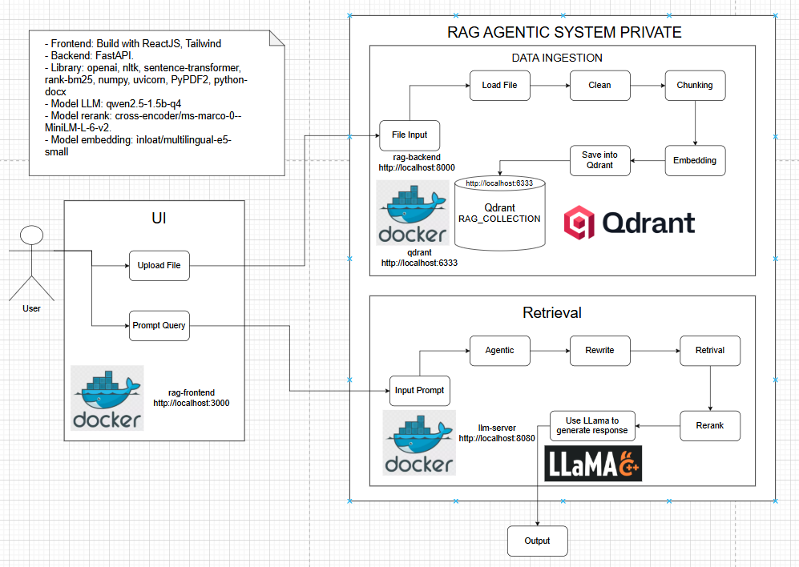

# 🚀 RAG PRIVATE
### Private Retrieval-Augmented Generation Agentic System

A **Private RAG Agentic (Retrieval-Augmented Generation Agentic)** system that allows users to **upload documents and query knowledge from them using a local LLM**, without relying on external APIs.

This project focuses on building a **fully local AI system** where all data and processing stay **private and secure**.

---

# 📖 Overview

The system allows users to:

- Upload documents
- Automatically split documents into chunks
- Store embeddings in a vector database
- Retrieve relevant context when users ask questions
- Generate answers using a local LLM

The goal of this project is to demonstrate a **complete RAG pipeline**, from **document ingestion to AI-generated answers**.

---

# 🏗 Architecture

The system follows a typical **RAG pipeline architecture**:


# ⚙️ Technologies Used

This project combines several modern AI and web technologies to build a **fully local Retrieval-Augmented Generation (RAG) system**.

### 🧠 AI / Machine Learning

- **LLM:** : use llama.cpp (qwen2.5-1.5b-q4) 
- **Inference Engine:** : qwen2.5-1.5b-q4 for running the LLM locally  
- **Embeddings:** : use Sentence Transformer (intfloat/multilingual-e5-small) for semantic search  
- **Rerank:** : use Sentence Transformer (cross-encoder/ms-marco-MiniLM-L-6-v2) for reranking

---

### 🔎 Retrieval System

- **Vector Database:** : use Qdrant to manage data 
- **RAG Pipeline:** 
For query's user: agentic → rewrite → retrieval → reranking → generation  
For file upload of user: load → clean → chunking → embedding → save qdrant
---

### 🖥 Backend

- **Language:** : Python 
- **API Framework:** : FastAPI  
- **LLM API Interface:** : http://llama-server:8080 

---

### 🌐 Frontend (Generated By AI)

- **Framework:** React
- **Language:** TypeScript
- **Styling:** Tailwind CSS

---

### 🐳 Infrastructure

- **Containerization:** : Docker
- **Orchestration:** : Docker Compose

---

# 🔬 Methods

The system applies multiple techniques in the RAG pipeline to improve retrieval accuracy and response quality.

---

### 1. Document Loading

The system supports multiple document formats including:

- PDF
- DOCX
- TXT

Documents are parsed and converted into raw text before further processing.

---

### 2. Text Cleaning

Before indexing, the text is cleaned to remove noise such as:

- HTML tags
- extra whitespace
- unsupported characters

This ensures better chunking and embedding quality. 

---

### 3. Text Chunking

Documents are split into smaller **chunks based on sentences** with an overlap strategy.

Chunking improves retrieval because smaller text segments can better match user queries.

Benefits:

- improves retrieval precision
- prevents context overflow
- allows fine-grained search

---

### 4. Dense Embedding Retrieval

Each text chunk is converted into a **vector embedding** using a sentence embedding model.

These vectors are stored in a vector database for semantic similarity search.

This allows the system to retrieve information based on **semantic meaning rather than exact keywords**.

---

### 5. Sparse Retrieval (BM25)

The system also uses **BM25 keyword search** for traditional lexical matching.

BM25 helps retrieve documents that contain exact keywords from the query.

---

### 6. Hybrid Retrieval

The system combines:

- **Dense vector search**
- **Sparse keyword search (BM25)**

This hybrid approach improves retrieval performance by capturing both **semantic similarity and keyword relevance**. 

---

### 7. Cross-Encoder Reranking

After retrieving candidate documents, a **cross-encoder reranker** evaluates the relevance of each document to the query.

The documents are then sorted by their reranking score to select the most relevant context.

Benefits:

- improves answer accuracy
- filters irrelevant chunks
- reduces hallucination

---

### 8. Query Rewriting

User queries can be rewritten using the LLM to improve retrieval quality.

The rewritten query helps the retrieval system better understand the user's intent.

---

### 9. Agentic Query Classification

An agent component analyzes the query and determines the type of request, such as:

- summary
- definition
- explanation
- comparison
- listing
- question answering

---

### 10. Retrieval-Augmented Generation (RAG)

Finally, the top retrieved document chunks are injected into the prompt as **context** for the LLM.

The LLM then generates answers based on:

- the user query
- the retrieved document context

---

### How to implement this project

# 1. Download the project

First, download the project to your local machine.

You can do this in two ways:

### Option 1 — Clone the repository (recommended)

```bash
git clone <your-repository-url>
```

Then move into the project directory:

```bash
cd RAG_PRIVATE
```

### Option 2 — Download ZIP

1. Go to the GitHub repository
2. Click **Code → Download ZIP**
3. Extract the ZIP file to your computer
4. Open a terminal in the extracted folder

---

# 2. Download the LLaMA model

Open CLI (Command Line at source project)

This project uses the **Qwen2.5 1.5B Q4 quantized model**.

First, open a terminal in the root project directory and run:

```bash
huggingface-cli download Qwen/Qwen2.5-1.5B-Instruct-GGUF \
  qwen2.5-1.5b-instruct-q4_k_m.gguf \
  --local-dir ./models
```

After downloading, the model will be stored in:

```
./models/qwen2.5-1.5b-instruct-q4_k_m.gguf
```

Example project structure:

```
RAG_PRIVATE
│
├── backend
├── frontend
├── models
│   └── qwen2.5-1.5b-instruct-q4_k_m.gguf
├── docker-compose.yml
└── README.md
```

This model will be loaded by the **llama.cpp server** when the backend starts.

# 3. Start the system with Docker

Make sure you have installed:

- Docker
- Docker Compose

Then run:

```bash
docker compose up --build
```

Docker will start multiple services including:

- Backend API
- LLM server
- Vector database
- Frontend application

---

# 4. Access the application

Once the containers are running, open your browser and go to:

```
http://localhost:3000
```

You should now see the **Private RAG interface**.

---

# 5. Upload documents

Upload documents such as:

- PDF
- TXT
- DOCX

The system will automatically:

1. Extract text
2. Split text into chunks
3. Generate embeddings
4. Store them in the vector database

---

# 6. Ask questions

After uploading documents, you can ask questions in the chat interface.

The system will:

1. Convert the question into embeddings
2. Retrieve relevant chunks
3. Rerank the results
4. Send the context to the LLM
5. Generate the final answer

# 7. The api to test all function

Backend: Uvicorn (http://localhost:8000) (You can wait a few minutes to backend start)

Frontend: (http://localhost:3000)

Qdrant: (http://localhost:6333)

LLaMa: (http://localhost:8080)

---

# 🧭 How to Use Application "Private RAG Agentic"

### 1 Upload Documents

Users upload documents through the web interface.

The backend will automatically:

- Extract text from the document
- Split the text into chunks
- Generate embeddings
- Store vectors in the vector database

### 2 Ask Questions

Users can ask questions in the chat interface.

The system will:

1. Convert the question into embeddings
2. Retrieve relevant chunks from the vector database
3. Rerank the retrieved results
4. Send the context to the LLM
5. Generate the final answer

---

### 3 View Sources

The system also returns **source snippets** so users can see where the answer came from.

---

# ✅ Advantages

### 1. Fully Private AI System

All processing is done **locally**, meaning:

- No external LLM APIs are required
- Sensitive documents never leave the system
- Full control over data privacy

This makes the system suitable for **internal knowledge bases, enterprise data, and private documents**.

---

### 2. Hybrid Retrieval Improves Accuracy

The system combines:

- **Dense vector search**
- **BM25 keyword search**

This hybrid retrieval approach helps the system retrieve relevant documents even when semantic similarity alone is not enough.

---

### 3. Reranking Improves Answer Quality

A **cross-encoder reranking model** evaluates retrieved documents and selects the most relevant ones.

Benefits:

- better context selection
- higher answer accuracy
- reduced hallucination

---

### 4. Agentic Query Processing

The system uses an **agent layer** to analyze the user query and determine the appropriate response strategy.

This allows the system to support different query types such as:

- explanation
- summarization
- comparison
- question answering

---

### 5. Modular Architecture

The system is designed with a **modular architecture**, making it easy to:

- replace the LLM
- switch vector databases
- upgrade embedding models
- add new retrieval strategies

---

### 6. RAG Evaluation (RAGAS)

Faithfulness:        0.7143  
Answer Relevancy:    0.5865  
Context Precision:   0.9792  
Context Recall:      1.0000

These results indicate that the retriever retrieves highly relevant contexts (high precision and recall), while the generator produces mostly faithful responses grounded in retrieved documents.

---

# ⚠️ Limitations

### 1. Limited LLM Capability

The system currently uses a **small local model** (e.g. `qwen2.5-1.5b`).

Compared to large models, it may:

- produce less detailed answers
- struggle with complex reasoning
- have lower language fluency

---

### 2. Hardware Requirements

Running local LLMs and embedding models requires:

- sufficient **RAM**
- **CPU or GPU resources**

Large document collections may increase indexing and retrieval time.

---

### 3. Retrieval Quality Depends on Chunking

Poor chunking strategies may reduce retrieval performance.

If chunks are too large or too small, relevant context might not be retrieved effectively.

---

# 🚀 Future Improvements

### 1. Support Larger LLM Models

Future versions could integrate stronger models such as:

- larger **Qwen models**
- **Llama models**
- other high-performance open-source LLMs

---

### 2. Improve Retrieval with Advanced Techniques

Potential improvements include:

- **multi-query retrieval**
- **query expansion**
- **semantic filtering**
- **better hybrid weighting**

---

### 3. Add Streaming Responses

Streaming responses can improve user experience by allowing answers to appear **in real time**.

---

### 4. Improve Document Processing

Future work may include:

- better **document parsing**
- support for **tables and images**
- improved **semantic chunking**

---

### 5. Knowledge Graph Integration

Combining RAG with a **knowledge graph** could improve reasoning and structured information retrieval.


