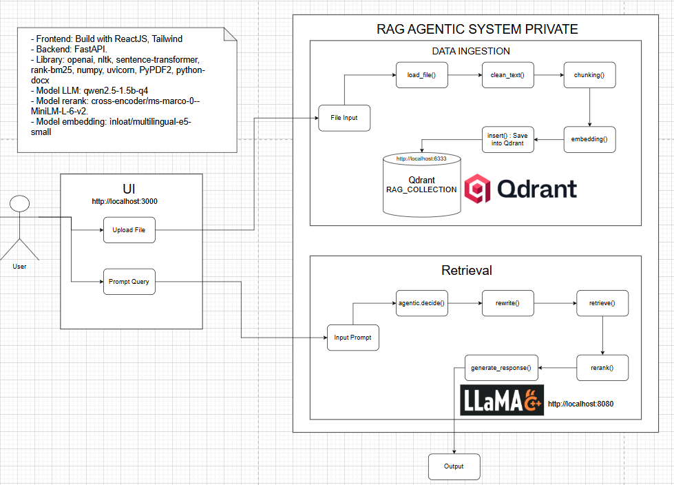

# 🚀 RAG PRIVATE
### Private Retrieval-Augmented Generation System

A **Private RAG (Retrieval-Augmented Generation)** system that allows users to **upload documents and query knowledge from them using a local LLM**, without relying on external APIs.

This project focuses on building a **fully local AI system** where all data and processing stay **private and secure**.

---

# 📖 Overview

The system allows users to:

- Upload documents
- Automatically split documents into chunks
- Store embeddings in a vector database
- Retrieve relevant context when users ask questions
- Generate answers using a local LLM

The goal of this project is to demonstrate a **complete RAG pipeline**, from **document ingestion to AI-generated answers**.

---

# 🧭 How to Use

### 1 Upload Documents

Users upload documents through the web interface.

The backend will automatically:

- Extract text from the document
- Split the text into chunks
- Generate embeddings
- Store vectors in the vector database

### 2 Ask Questions

Users can ask questions in the chat interface.

The system will:

1. Convert the question into embeddings
2. Retrieve relevant chunks from the vector database
3. Rerank the retrieved results
4. Send the context to the LLM
5. Generate the final answer

---

### 3 View Sources

The system also returns **source snippets** so users can see where the answer came from.

---

# 🏗 Architecture

The system follows a typical **RAG pipeline architecture**:

